# PROYEK UJIAN AKHIR SEMESTER IF580-C
# COMPUTER GRAPHIC AND ANIMATION

- Farrel Dinarta / 00000055702
- Bryan Richie Irawan / 00000056044
- Gregory Kurniawan / 00000056349
- Aurelius Ivan Wijaya / 00000054769
- Kafijaya / 00000061651

### TUTORIAL REPLIKASI PROYEK UAS

1. Buat project baru dengan editor 2021.
2. Import file .unitypackage yang terlampir. 
3. Setelah proses import selesai, pergi ke menu File -> Build and Settings, lalu masukkan MainScene, WinScene, LoseScene, dan IntroMenu pada kotak Scenes in Build seperti pada gambar berikut (bisa dengan Drag & Drop). Setelah itu, tekan CTRL + S untuk Save, dan klik tombol X pada dialog Build and Settings yang telah dibuka.

4. Karena input yang kami gunakan menggunakan Input Manager dari Unity dan tidak bisa diekspor didalam package, maka pergi ke folder ProjectSettings pada root directory proyek (bukan pada editor)
dan ganti file InputManager.asset yang lama dengan file InputManager.asset yang terlampir.

5. Setelah itu, pergi ke tab Assets -> Reimport All.

6. Untuk render Universal Render Pipeline, pergi ke Window -> Package Manager. 
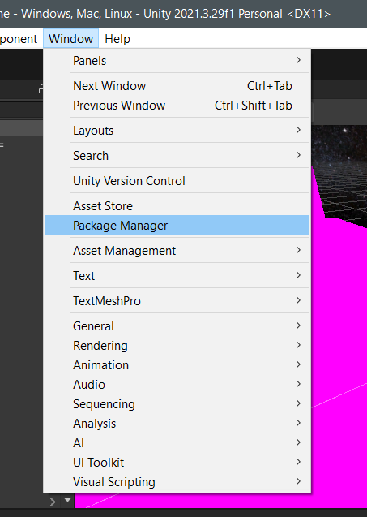
7. Klik dropdown `Packages : In project`, ubah ke `Unity Registry`.
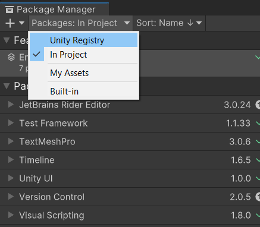
8. Cari package `Universal RP`.
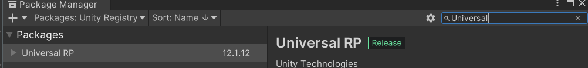
9. Install dependency tersebut.
10. Setelah selesai, tutup dialog package manager tersebut, dan buka navigasi Edit -> Project Settings.
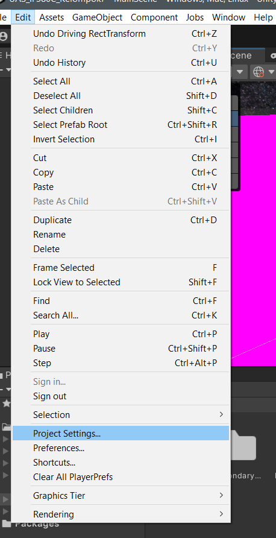
11. Pilih menu Graphics -> URP Global Settings, lalu tekan tombol lingkaran dengan kotak pada bagian kanan, lalu pilih URP yang telah terinstall.
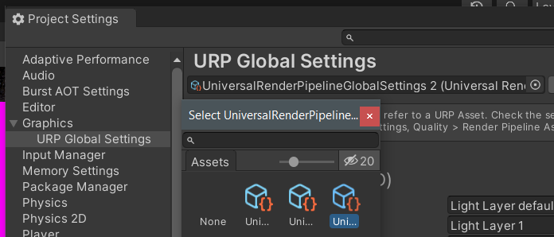
12. Pilih menu Quality, lalu pilih menu Render Pipeline Asset dan pilih Asset Pipeline yang telah diinstall.
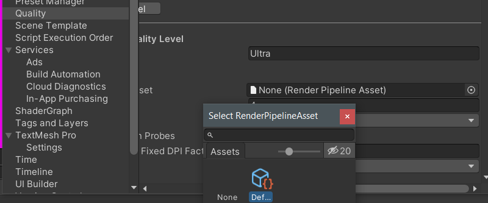
13. Tekan tombol Continue pada dialog konfirmasi.
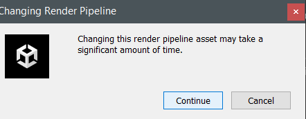
14. Kembali ke navigasi Edit -> Project Settings, pergi ke menu Scene Template, tekan semua checkbox yang tersedia.
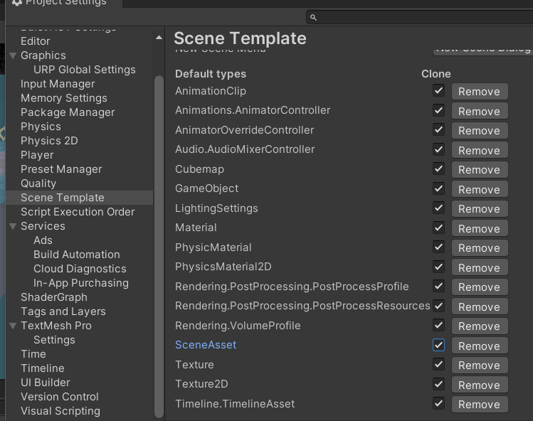
15. Menuju Assets -> Reimport All kembali projek.
16. Kembali ke Edit -> Project Settings, pergi ke menu Graphics dan ubah menjadi seperti ini. 
17. Pilih menu Graphics, ubah setelan menjadi seperti gambar dibawah.
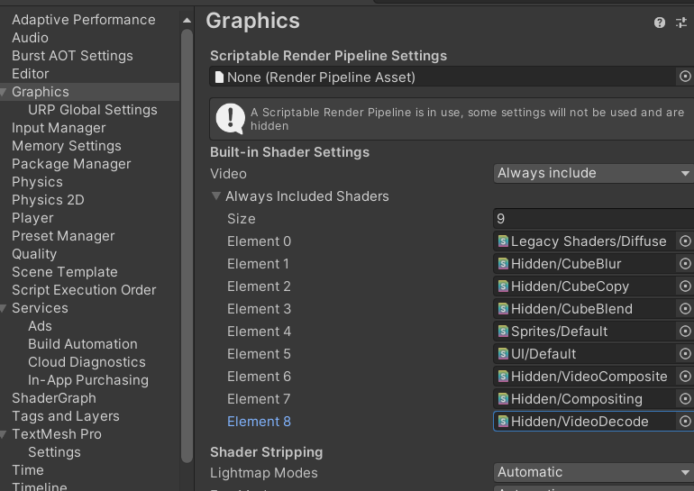
**Apabila steps dibawah tidak muncul, coba lakukan CTRL + S (SAVE) dan Reimport All kembali**
18. Cari GameObject Player -> MainCamera
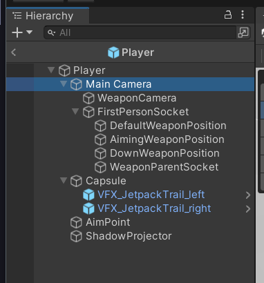
19. Add Component Volume
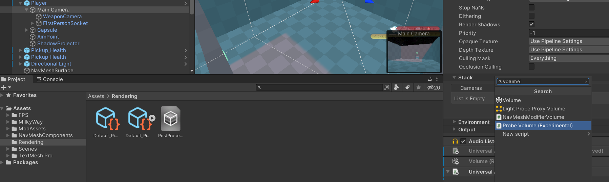
20. Pilih PostProcessingProfile untuk Profilenya.
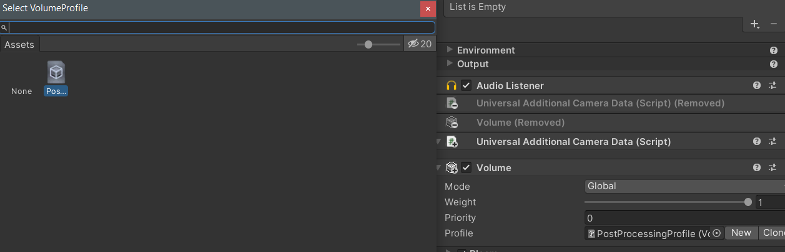
21. Cari GameObject Player -> WeaponCamera, cari Component `Rendering`, ubah Culling Mask menjadi
FirstPersonWeapon
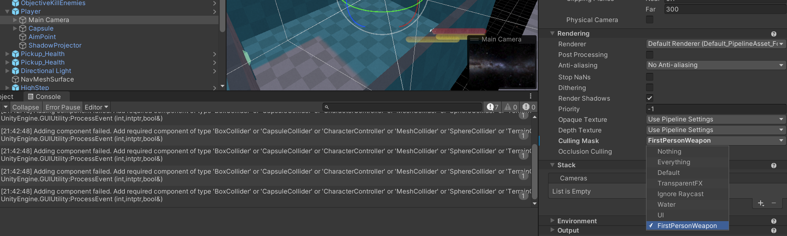

6. Proyek siap digunakan.
