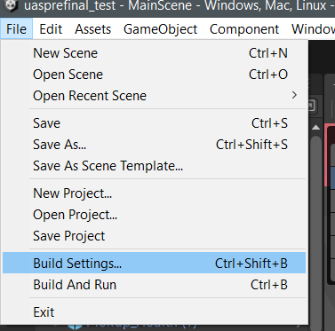
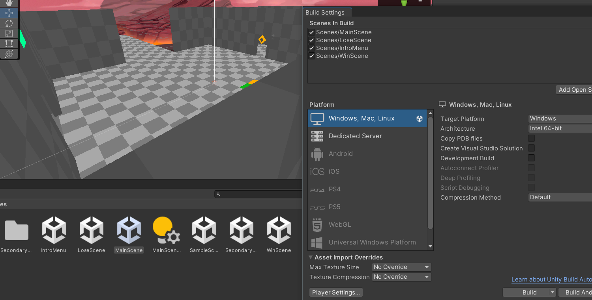
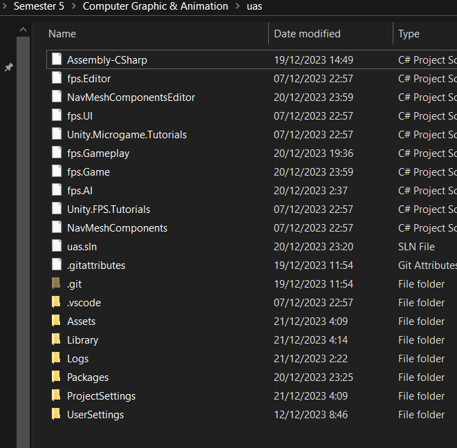
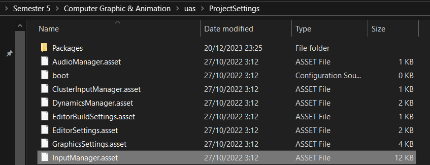
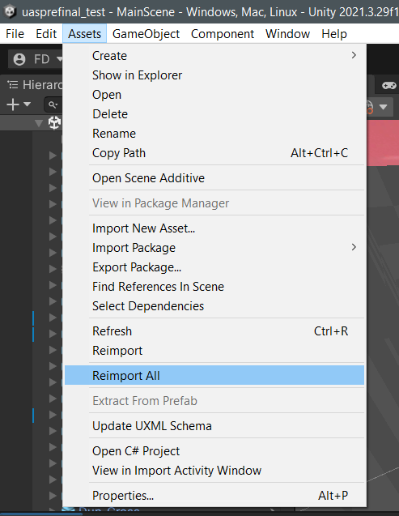

# PROYEK UJIAN AKHIR SEMESTER IF580-C
# COMPUTER GRAPHIC AND ANIMATION

- Farrel Dinarta / 00000055702
- Bryan Richie Irawan / 00000056044
- Gregory Kurniawan / 00000056349
- Aurelius Ivan Wijaya / 00000054769
- Kafijaya / 00000061651

### TUTORIAL REPLIKASI PROYEK UAS

1. Buat project baru dengan editor 2021.
2. Import file .unitypackage yang terlampir. 
3. Setelah proses import selesai, pergi ke menu File -> Build and Settings, lalu masukkan MainScene, WinScene, LoseScene, dan IntroMenu pada kotak Scenes in Build seperti pada gambar berikut (bisa dengan Drag & Drop)

4. Karena input yang kami gunakan menggunakan Input Manager dari Unity dan tidak bisa diekspor didalam package, maka pergi ke folder ProjectSettings pada root directory proyek (bukan pada editor)
dan ganti file InputManager.asset yang lama dengan file InputManager.asset yang terlampir.

5. Setelah itu, pergi ke tab Assets -> Reimport All.

6. Proyek siap digunakan.
